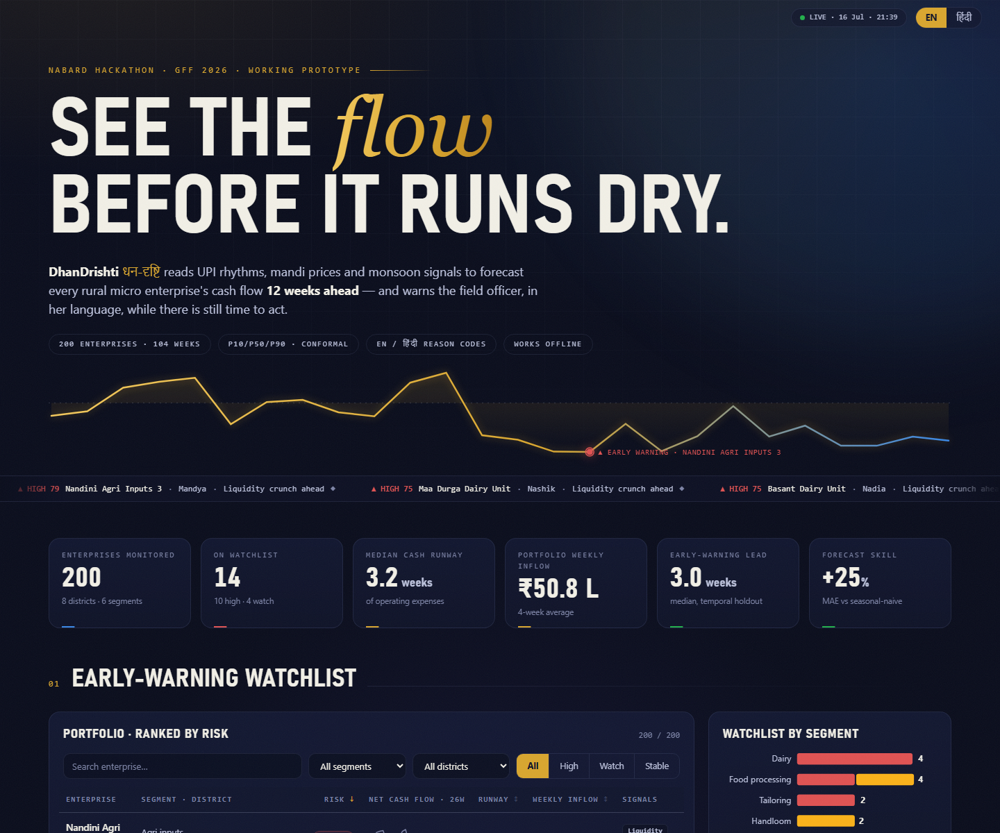
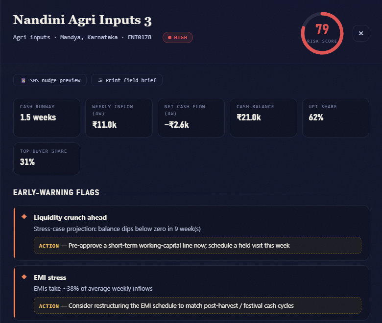
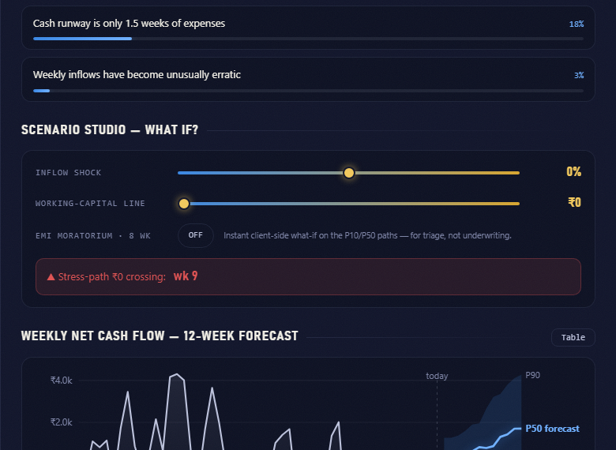
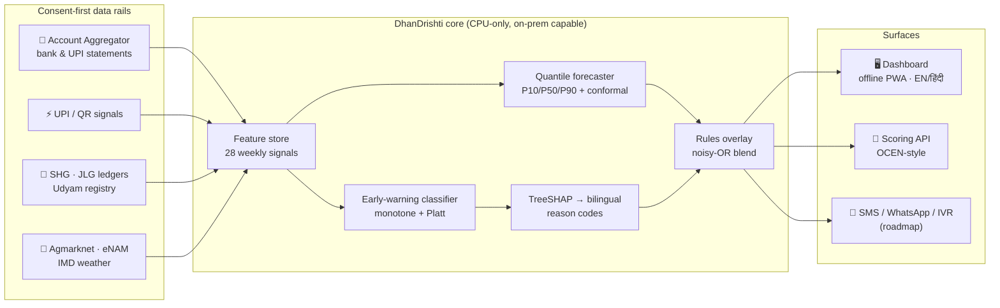

<div align="center">

# 👁 DhanDrishti

### धन‑दृष्टि — *"wealth‑sight"*

**Cash‑flow foresight & early‑warning intelligence for rural micro enterprises**

*See the flow, before it runs dry.*

<br>


<br>



<br>

**[NABARD Hackathon @ GFF 2026](https://hackculture.io/hackathons/nabard-hackathon-gff-2026)** · theme: *AI‑Driven Cash Flow Prediction & Risk Flagging for Rural Micro Enterprises*

[⚡ Quickstart](#-quickstart) · [🎬 90‑second demo](#-the-90-second-demo) · [✨ Features](#-features) · [🧠 The AI, honestly](#-the-ai-honestly) · [🏗 Architecture](#-architecture) · [🗺 Roadmap](#-roadmap)

</div>

---

> **The problem in one breath.** Only **~14%** of India's 6.3 crore MSMEs can access formal credit; the gap is worst in rural districts (**~32%**). Lenders discover distress only *after* an EMI is missed — by then the intervention window has closed. Yet the signal already exists: **UPI** (~21.7 B txns/month), the **Account Aggregator** framework (₹1.67 L Cr disbursed in FY25), open **mandi** and **monsoon** data. Nobody has fused it into enterprise‑level cash‑flow foresight for Bharat. **DhanDrishti does.**

For every enrolled enterprise, DhanDrishti produces four things:

|   | Output | Answers |
|---|--------|---------|
| 📈 | **12‑week probabilistic forecast** — P10/P50/P90, conformally calibrated | *"Will there be a liquidity crunch before Diwali?"* |
| 🚨 | **Risk score (0–100) + early‑warning flags** | *"Who in my portfolio needs attention this week?"* |
| 🗣 | **Bilingual reason codes** (TreeSHAP → EN/हिंदी) | *"Explain the alert so I can act on it."* |
| 🧭 | **Recommended intervention** per flag | *"What exactly do I do — restructure, advance, diversify?"* |

---

## ⚡ Quickstart

```bash
cd prototype
pip install -r requirements.txt
cd src
python generate_data.py     # ~5 s  · 200 enterprises × 104 weeks, ground-truth distress episodes
python train.py             # ~1 min · quantile forecaster + calibrated classifier + flags
python -m uvicorn app:app --port 8765
```

Open **http://localhost:8765** — then turn your Wi‑Fi off and keep clicking. Everything still works. 📴

---

## 🎬 The 90‑second demo

1. **Watch the hero** — the gold pulse is the top‑risk enterprise's *actual* cash‑flow history drawing itself; the red dot is its early warning.
2. **Read the ticker** — every HIGH/WATCH alert scrolls past. Click one.
3. **The drill‑down** — risk dial sweeps to **79**; two flags (*Liquidity crunch ahead*, *EMI stress*), each with a concrete action.
4. **Tap हिंदी** — every reason and action switches: *"नकदी संकट की आशंका… अभी अल्पकालिक कार्यशील‑पूंजी सीमा स्वीकृत करें।"*
5. **Scenario Studio** — drag *Working‑capital line* to ₹50k → the stress path lifts, **"₹0 crossing: wk 9 → averted ✓"**. That slider is the loan officer's decision, previewed.
6. **📱 SMS nudge** — the vernacular message the entrepreneur would receive. **🖨 Print field brief** — a one‑page handout for the visit.
7. **Ctrl + K** — fuzzy‑search all 200 enterprises. **⬇ CSV** — export the filtered watchlist.

<div align="center">
<table>
  <tr>
    <td align="center"><br><sub><b>The drill‑down</b> — dial, flags, actions</sub></td>
    <td align="center"><br><sub><b>Scenario Studio</b> — what‑if, answered live</sub></td>
  </tr>
</table>
</div>

---

## ✨ Features

| | Feature | Detail |
|---|---------|--------|
| 🌊 | **Living hero pulse** | Real top‑risk cash‑flow history, self‑drawing SVG, early‑warning marker |
| 📡 | **Live alert ticker** | Marquee of every HIGH/WATCH enterprise + top flag; click‑through |
| 🎛 | **Scenario Studio** | Inflow shock ±30% · EMI moratorium · working‑capital line → live stress‑path & ₹0‑crossing verdict |
| 📱 | **SMS nudge preview** | The vernacular alert as the entrepreneur would receive it (simulated) |
| 🖨 | **Printable field brief** | One‑page visit handout — flags, reasons, KPIs, 4‑week forecast |
| ⌨️ | **Command palette** | `Ctrl+K` fuzzy search across name / district / segment |
| 📊 | **Risk‑ranked watchlist** | 200 enterprises, sparklines, animated risk bars, signal chips, sort/filter/search |
| 🎯 | **Animated risk dial** | Arc sweeps to the calibrated score, colored by tier |
| 🔍 | **Crosshair charts** | Hover crosshair + snap‑dot + tooltips; one‑click table view (a11y) |
| 🔗 | **Deep links** | `/#ENT0178` opens that enterprise — hand the jury a URL |
| ⬇ | **CSV export** | Filtered watchlist for branch workflows |
| 🌗 | **EN / हिंदी everywhere** | Flags, reasons, actions, SMS, print brief, scenario verdicts |
| 📴 | **Offline by construction** | Zero CDNs, zero external fonts; `?noanim` + `prefers-reduced-motion` honored |
| ☄️ | **Observatory ambience** | Aurora drift, film grain, comets, parallax, 3D‑tilt KPIs, sheen, scroll progress |

---

## 🧠 The AI, honestly

No black boxes, no GPU worship — models a regulator can read:

- **Quantile forecaster** — LightGBM P10/P50/P90, direct multi‑horizon (12 wk), **conformalized** on a temporal holdout so the 80% band *actually covers 80%*.
- **Early‑warning classifier** — predicts distress within 8 weeks under **domain monotonicity constraints** (risk may only rise as runway ↓, EMI burden ↑, volatility ↑) with **Platt calibration**.
- **Explainability as the product** — TreeSHAP attributions → a curated bilingual reason‑code vocabulary. *"Revenue is down ~58% vs the same season last year"*, not `feature_23=0.41`.
- **Rules that can't be embarrassed** — transparent overlays (stress‑path projection, EMI ratio, segment‑relative concentration) blended noisy‑OR with the model, so **the score and the flags can never contradict**.

<details>
<summary><b>📋 Model card — temporal holdout (click)</b></summary>

| Metric | Value |
|--------|-------|
| Forecast MAE vs seasonal‑naive | **−25%** (skill 0.25) |
| P10–P90 coverage (post‑conformal) | **80.0%** (nominal 80%) |
| Early‑warning AUC / avg precision | **0.83** / 0.51 (**13×** lift over 3.9% base) |
| Median warning lead before distress | **3 weeks** |
| Portfolio triage | 10 HIGH · 4 WATCH of 200 — every top‑10 alert is a genuine engineered distress ramp |
| Hardware | CPU‑only · retrains in ~1 min · RRB on‑prem deployable |

</details>

<details>
<summary><b>🗃 Synthetic data — what makes it credible (click)</b></summary>

200 enterprises × 104 weeks across **6 segments** (kirana, dairy, tailoring, agri‑inputs, food processing, handloom) and **8 districts**, with harvest/festival/monsoon seasonality, mandi price walks, UPI adoption drift, **owner household draws** (balances stay realistically lean), anchor‑buyer concentration, EMI obligations, and **ground‑truth distress ramps** — so accuracy is *measurable*, honestly. No real enterprise or personal data anywhere.

</details>

---

## 🏗 Architecture



**Privacy posture:** no Aadhaar numbers, no location tracking, no scraping. Pseudonymous features, logged AA consent artefacts, DPDP‑aligned. Full design: [docs/architecture.md](docs/architecture.md)

---

## 📁 Repository

```
├── docs/
│   ├── DhanDrishti_Concept_Note.docx / .pdf    Round-1 submission (fill team block §11)
│   ├── DhanDrishti_Pitch_Deck.pptx / .pdf      13 slides, product shots included
│   ├── architecture.md                         Full design document
│   └── assets/                                 UI captures + model-output figures
├── prototype/
│   ├── data/                                   Generated panel · scores.json · metrics.json
│   ├── models/                                 Trained LightGBM boosters
│   └── src/
│       ├── generate_data.py                    Synthetic panel w/ ground-truth distress
│       ├── features.py                         28 leakage-safe weekly features
│       ├── train.py                            Models + calibration + flags + reason codes
│       ├── app.py                              FastAPI · 3 endpoints · static host
│       └── static/                             The dashboard (vanilla JS, hand-rolled SVG)
└── SUBMISSION.md                               Deadlines & submission checklist
```

---

## 🗺 Roadmap

- [x] **Round 1 — working prototype** · forecaster + EWS + bilingual dashboard, measured
- [ ] **Round 2 (Jul 25 – Aug 15)** · AA‑sandbox integration (Setu/Finvu), SMS gateway pilot, demo video, deployment guide
- [ ] **District pilot** · one RRB/DCCB partner, 500–1,000 consented enterprises; measure lead time, intervention uptake, repayment vs control
- [ ] **Scale** · NABARD ecosystem roll‑out, OCEN‑integrated scoring API, Marathi · Telugu · Bangla reason codes

---

<div align="center">

<sub>**Team «name»** — fill §11 of the concept note & the last deck slide before submitting · deadline **20 Jul 2026, 11:59 PM IST**</sub>

<br><br>

*"दृष्टि — sight, before the storm."*

<sub>Built for the NABARD Hackathon @ Global FinTech Fest 2026 · synthetic data only · consent‑first by design 🌾</sub>

</div>
