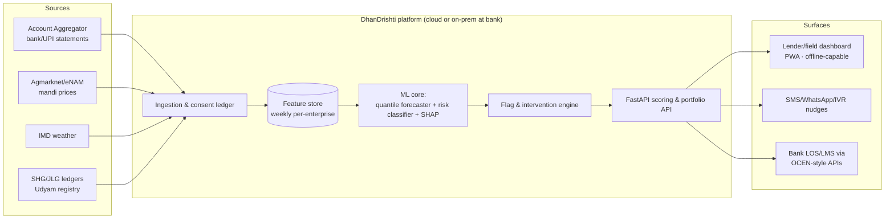

# DhanDrishti — Architecture & Design

**AI-Driven Cash Flow Prediction & Risk Flagging for Rural Micro Enterprises**
NABARD Hackathon @ GFF 2026 · Theme: AI for Rural Finance

---

## 1. The problem we are solving

- Only ~14% of India's ~6.3 crore MSMEs have access to formal credit (Deloitte, 2025); the credit gap is ≥ ₹25 lakh crore and is worst in rural areas (~32% vs ~20% urban).
- Rural micro enterprises (kirana stores, dairy units, tailoring, agri-input shops, food processing, handloom) are **credit-invisible**: no audited books, thin bureau files, cash-heavy and seasonal income.
- Lenders (RRBs, DCCBs, MFIs, SFBs) detect stress **after** a missed EMI. Field officers have no early-warning tooling; interventions come too late.
- Meanwhile the raw signal now exists: UPI (21.7B txns/month), Account Aggregator (₹1.67 lakh crore disbursed via AA rails in FY25), mandi price feeds, weather data. Nobody has stitched these into **enterprise-level cash-flow foresight** for Bharat.

## 2. What DhanDrishti does

For every enrolled micro enterprise, DhanDrishti continuously produces:

1. **Probabilistic cash-flow forecast** — weekly net cash flow, 12-week horizon, with P10/P50/P90 confidence bands (quantile ML). Answers: *"Will this enterprise have a liquidity crunch before Diwali?"*
2. **Risk score (0–100) + discrete early-warning flags** — e.g. `LIQUIDITY_CRUNCH_AHEAD`, `REVENUE_CONCENTRATION`, `SEASONAL_DIP_UNPREPARED`, `PAYMENT_IRREGULARITY`, `EMI_STRESS`. Each flag carries **plain-language reason codes** derived from SHAP attributions — in English and Hindi — so a field officer can act on it, not just read a number.
3. **Recommended interventions** — rule + model driven: pre-approve working-capital top-up before festival demand, restructure EMI to post-harvest, nudge diversification when one buyer is >60% of inflows.
4. **Portfolio early-warning system (EWS)** — district/segment heatmaps and ranked watchlists for lenders and NABARD field teams.

### Personas
| Persona | Surface | What they get |
|---|---|---|
| Lender (RRB/DCCB/MFI/SFB) | Web dashboard + scoring API | Portfolio EWS, drill-downs, cash-flow-based underwriting score |
| Field officer / BC sakhi | Same dashboard (PWA, offline-capable) | Prioritised visit list, reason codes in Hindi, one-tap intervention log |
| Rural entrepreneur | SMS/WhatsApp/IVR (roadmap) | Vernacular nudges: "Cash dip likely in 3 weeks; stock less perishable inventory" |

## 3. Data strategy (consent-first, DPI-native)

| Source | Signal | Access rail |
|---|---|---|
| Bank statements / UPI txns | Inflow/outflow rhythm, counterparty diversity, balance trajectory | **Account Aggregator** (consented pull) |
| QR / UPI merchant payments | Daily revenue proxy, customer count, ticket size | PSP APIs / AA |
| SHG/JLG ledgers, Udyam registry | Group repayment history, enterprise vintage & segment | NABARD / SHG federation MoUs |
| Mandi & commodity prices | Input-cost and realisation trends for agri-linked units | Agmarknet / eNAM open data |
| Weather & crop calendar | Monsoon risk, harvest-cycle timing | IMD open data |
| Festival/event calendar | Demand seasonality (Diwali, wedding season, local haats) | Static + curated |

- **No sensitive personal data**: no Aadhaar numbers, no location tracking, no social-media scraping. DPDP-Act-aligned; consent artefacts logged per AA framework.
- **Cold start**: segment-level priors (a new dairy unit inherits the dairy seasonality prior) refined as transaction history accrues.

## 4. AI approach

```
raw streams ──► feature store ──► [1] Quantile forecaster (LightGBM, P10/P50/P90)
   (weekly)        (per-enterprise      ──► 12-week cash-flow bands
                    rolling features)  [2] Risk classifier (LightGBM + calibration)
                                            ──► risk score 0–100
                                       [3] SHAP attribution → reason-code mapper
                                            ──► top-K drivers, EN + HI templates
                                       [4] Rules overlay (domain guardrails)
                                            ──► flags + recommended interventions
```

- **Segment-aware**: six enterprise archetypes (kirana, dairy, tailoring, agri-inputs, food processing, handloom) with distinct seasonality priors; segment is a first-class feature, not a separate model per segment (keeps it deployable).
- **Explainability is a feature, not an afterthought**: SHAP values → curated reason-code vocabulary (~20 codes) → bilingual templates. RBI's digital-lending guidelines and fair-lending expectations favour this.
- **Probabilistic, not point estimates**: P10 band drives the `LIQUIDITY_CRUNCH_AHEAD` flag (worst-case planning), P50 drives underwriting.
- **Roadmap**: gradient-boosting → temporal fusion transformer once per-enterprise history deepens; GenAI layer (Claude) for free-form vernacular advisory over the structured outputs.

## 5. System architecture



- **Low-network by design**: dashboard is a PWA with cached last-sync state; scoring runs server-side but field views degrade gracefully to SMS. Models are small (LightGBM ⇒ CPU-only, on-prem deployable at an RRB data centre).
- **Privacy**: consent ledger, purpose limitation, no PII in features (IDs are pseudonymous).

## 6. Prototype scope (this repo)

| Layer | Implementation |
|---|---|
| Data | Synthetic-but-realistic generator: 200 enterprises × 6 segments × 104 weeks; harvest/festival seasonality, monsoon shocks, UPI adoption drift, idiosyncratic stress episodes with ground-truth distress labels |
| Models | LightGBM quantile regressors (P10/P50/P90, 12-wk horizon) + LightGBM risk classifier + SHAP reason codes |
| API | FastAPI: `/api/portfolio`, `/api/enterprise/{id}`, `/api/meta` |
| UI | Single-page dashboard (vanilla JS + hand-rolled SVG charts — zero CDN, works fully offline): KPI tiles, risk-ranked portfolio, enterprise drill-down with forecast bands, flags, bilingual reason codes, interventions |
| Eval | Backtest: forecast pinball loss / MAPE vs naive-seasonal baseline; risk AUC & early-warning lead time (weeks of advance notice before ground-truth distress) |

## 7. Why this wins (evaluation-criteria mapping)

- **Innovation**: probabilistic cash-flow bands + explainable early-warning flags + bilingual reason codes — not another opaque credit score.
- **Relevance**: NABARD's exact mandate — RRB/DCCB/SHG ecosystem, cash-flow-based lending push, DPI-native.
- **Feasibility**: boring-but-deployable ML (CPU-only), open data rails, consent framework that already exists at scale; working prototype today.
- **Impact**: earlier interventions → lower NPAs for rural FIs; bankable cash-flow records → formal credit for the 86% locked out.
